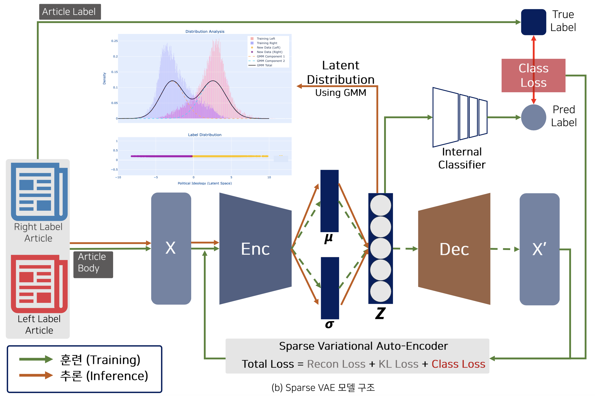

# poli-spectrum

&emsp;Official implementation of "Poli-Spectrum: A Spectral Approach to Political Stance Detection". This repository contains codes for the training and step and other complementary codes on the english political news data, BIGNEWSBLN-Right/Left from "<i><b>POLITICS: Pretraining with Same-story Article Comparison for Ideology Prediction and Stance Detection(Liu et.al, Findings of NAACL 2022)</b></i>".

 

&nbsp;&emsp;This idea was designed to overcome the limitations of the existing methods, using PCT(Political Compass Test) to detect and compare the political stances among the models, individual texts or documents, and the overall datasets. Although PCT is still a useful method to measure the political stances based on 62 closed-ended questions, my suggested idea could be much more objective and efficient due to its training data as training goal was to contain all the other political news articles which contains various political perspectives to compare objectively based on the latent space of the model. By comparing relatively subjective issues in the closed latent space, measuring could be more objective than just using off-the-shelf classifiers or sort of other tools.

 

&nbsp;&emsp;This research had been presented at the <i><b>Korea Data Mining Society (KDMS 2024 Fall)</b></i> in a poster session.

 

&nbsp;&emsp;The codes are implemented in Python 3.8.16 and PyTorch 1.13.1.

